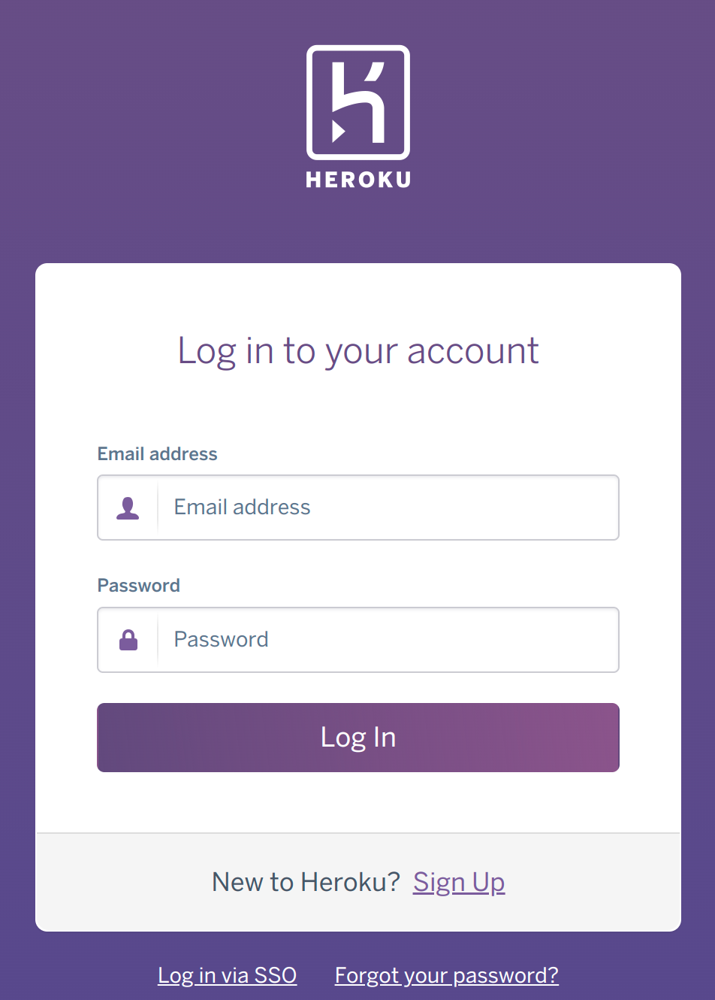
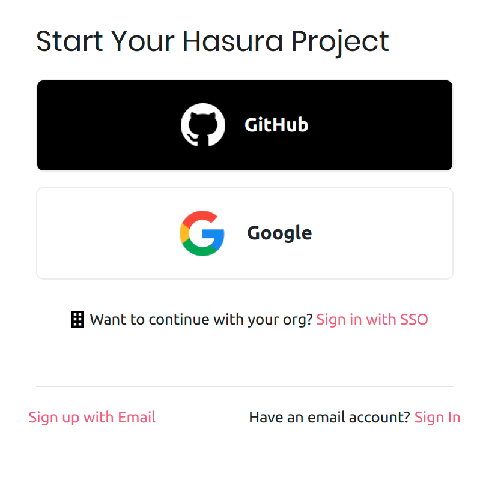
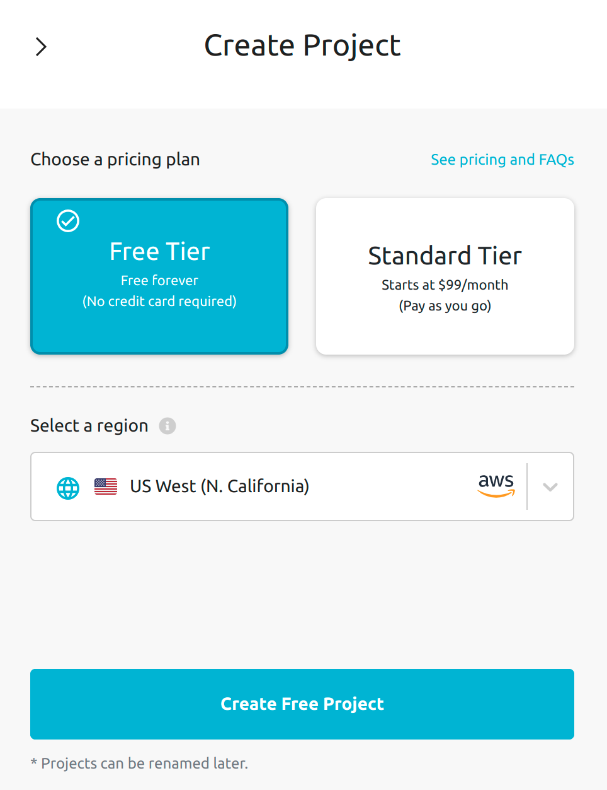
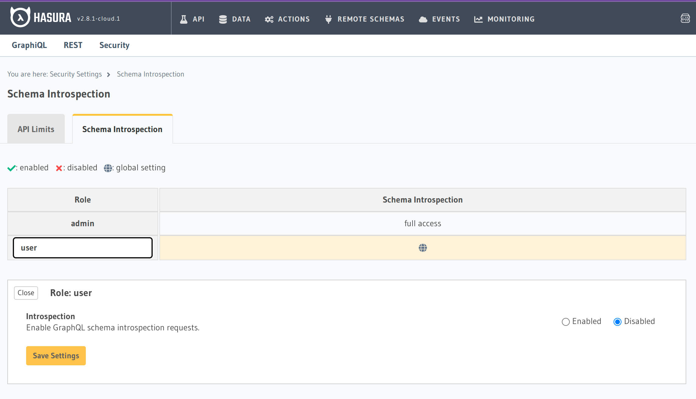
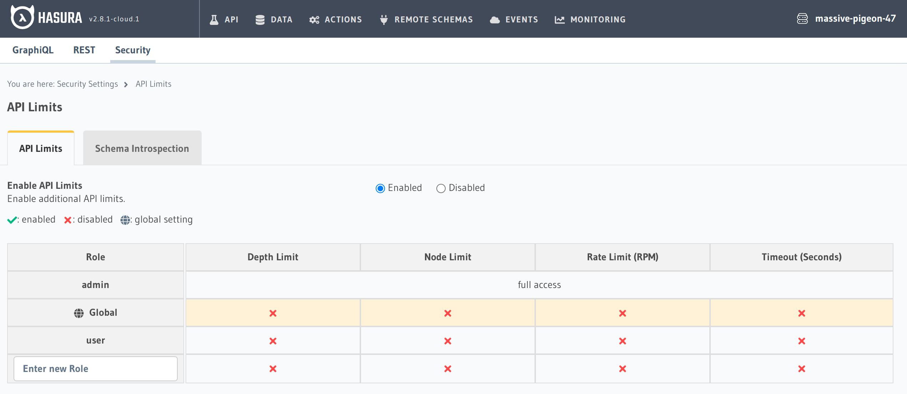

# 

# Introduction

## Program

-   [<del>Hasura Authentication</del>](https://hasura.io/docs/latest/graphql/core/auth/index/)
-   [Hasura API Limits](https://hasura.io/docs/latest/graphql/cloud/security/api-limits/)
-   [Hasura Authorization](https://hasura.io/docs/latest/graphql/core/auth/authorization/permission-rules/)
-   [Hasura Allow Lists](https://hasura.io/docs/latest/graphql/cloud/security/allow-lists/)
-   [Hasura REST Endpoints](https://hasura.io/docs/latest/graphql/core/api-reference/restified/)

Note that we don't illustrate authentication in this talk, though we
will touch on it briefly.

## Principles

-   **Risk Management:** *Life is about trade-offs.*
-   **Goal Setting:** *Confidentiality, Integrity, Availability*
-   **Defense in Depth:** *Bottom-Up*
-   **Simplicity:** *Complexity is the Enemy of Security*
-   **Least Privilege:** *The most secure API does nothing at all.*

## Threats

-   **Deep Queries:** *Confidentiality, Availability*
-   **Recursive Queries:** *Availability*
-   **Unbounded Queries:** *Confidentiality, Availability*
-   **Malicious Queries:** *Confidentiality*
-   **Batch Requests:** *Confidentiality, Availability*

.svg)

## Deep Queries / Recursive Queries

    query {
      author(id: 42) {
        posts {
          author {...and so on...
          }
        }
      }
    }

## Unbounded / Large Queries

    query {
      authors(first: 1000) {
        name
        posts(last: 100) {
          title
          content
        }
      }
    }

## Malicious Queries

    query User {
      user (id: "User*") {
        email
        id 
      }
    }

## Batch Requests

    query MaliciousQuery {
      alias1: fieldName { subField1 subField2 ...}
      alias2: fieldName { subField1 subField2 ...}
      ...
      alias10: fieldName { subField1 subField2 ...}
      ...
      alias100: fieldName { subField1 subField2 ...
      ...
      alias1000: fieldName { subField1 subField2 ...}
      ...
    }

# Workshop

## Log into Heroku

## Log into Hasura Cloud

## Create a new Hasura Cloud Project

## Create a new Heroku database

## <del>Connect to the database</del>

    psql -h <hostname> -p <port> -d <db> -U <username> psql
    heroku psql -a <app>

## <del>Secure the DB</del>

-   Create a dedicated DB user for PROD.
-   `REVOKE` DML (maybe).
-   `REVOKE` DDL (definitely).
-   Use a [separate dev instance](https://hasura.io/docs/latest/graphql/core/getting-started/docker-simple/) with elevated permissions for data modeling.
-   Use an env var like `PG_DATABASE_URL` with your Hasuras.

    -- Read-only? (not on Heroku hobby tier!)
    CREATE USER hasuraprod WITH PASSWORD 'hasuraprod';
    GRANT CONNECT ON DATABASE <db> TO hasuraprod;
    GRANT USAGE ON SCHEMA <schema> TO hasuraprod;
    GRANT SELECT ON ALL TABLES IN SCHEMA <schema> TO hasuraprod;
    GRANT EXECUTE ON ALL FUNCTIONS IN SCHEMA <schema> TO hasuraprod;

## Secure the Service

-   `HASURA_GRAPHQL_ADMIN_SECRET`

## <del>Add Authentication</del>

-   `HASURA_GRAPHQL_AUTH_HOOK`
-   `HASURA_GRAPHQL_AUTH_HOOK_MODE`

## <del>Disable Hasura Console</del>

-   `HASURA_GRAPHQL_ENABLE_CONSOLE`

## Disable Schema Introspection

## Create the Data Model

\#+INCLUDE "./initdata.sql" src sql

## Set API Limits

## Apply Permissions

## Use Allow Lists

## Create REST Endpoints

# Discussion

## GraphQL Security Orthodoxy

AKA: rituals, cargo cults, security theater which you can get anywhere

-   Disable Console Access
-   Disable Schema Introspection
-   Disable Query Suggestions (unnecessary in Hasura)
-   Impose API Limits
-   Whitelist Operations

## GraphQL Security Heterodoxy

AKA: possibly controversial opinions which you will get from me

-   Don't confuse public vs private:
-   If you don't *need* to provide a public API, then don't.
-   If you're not providing a public API, then don't act like you are.
-   Don't disable console access
-   If you applied the security principles carefully, deliberately, thoughtfully, then the console can't do anything unauthorized anyway.
-   Don't disable schema introspection and query suggestions.
-   The public will need to know how to use your public API (which you almost certainly shouldn't have anyway)
-   The public shouldn't have access to your private API (you did secure your API, add authentication, disable unauthorized access, build a rich data model, and apply fine-grained authorization, didn't you?)
-   The information will get out anyway.
-   Don't use GraphQL security
-   Or at least, don't rely on it.
-   Work diligently from the bottom-up, applying the principles carefully, deliberately, thoughtfully, and you (almost) won't need it.
-   Remember "managing risk", "cargo cults", and "security theater".

Life is about trade-offs.

-   Don't use GraphQL
-   For private APIs, that is.
-   Use Allow Lists.
-   And if you're using Allow Lists, you might as well use REST endpoints.
-   GraphQL is for *people* (i.e. developers), not for machines.

# Closing Remarks

## References

## How and where to get help

whitecheckmark
100
raisedhands

